    </a>
    </a>
    </a>
    </a>
    </a>

 <table>
   <tr>
     <td rowspan=2>  </td>
     <td> 
	      
     </td>
   </tr>
   <tr>
	   <td></td> 
   </tr>
   <tr>
	   <td rowspan="2"></td> 
   </tr>
   <tr>
	   <td align="center"></td> 
   </tr>
 </table>

